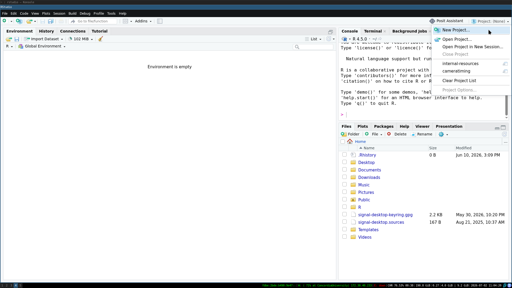
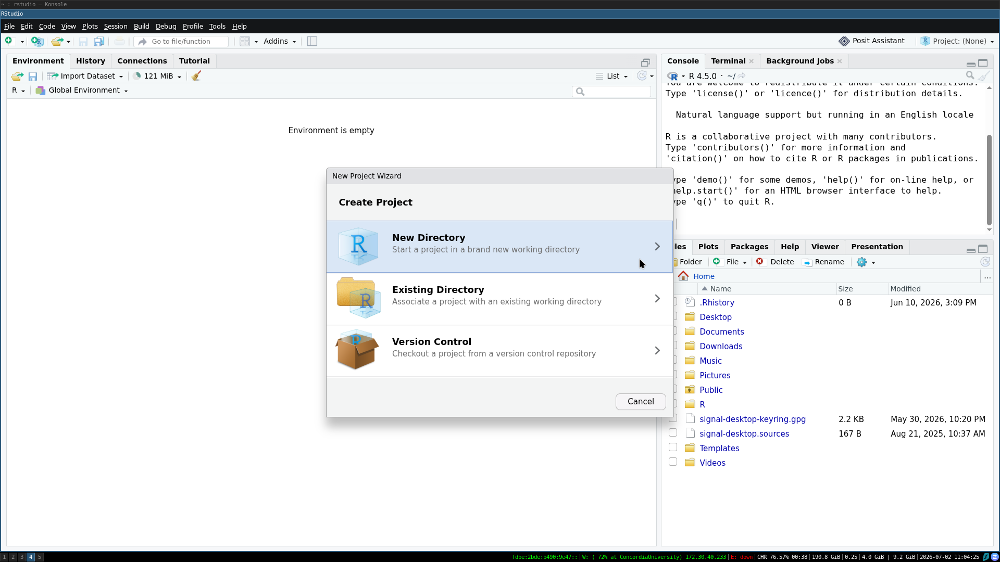

The ZULE lab highly values scientific transparency and reproducibility. One of the ways that we ensure our science is transparent and reproducible is through the consistent application of a data management and archiving policy.

Data comes in all shapes and sizes in this lab. This policy applies to you no matter how you collected and used your data (e.g., fieldwork, open data, data from previous studies, etc.). Data management should start *before* you start collecting your data, to ensure that it is done in a transparent and reproducible way and to facilitate data archiving.

## Before you collect data

### 1. Data sheets

Regardless of whether you are using a tablet or paper, thinking about how you set up your data sheets so that data is clear and easy to input is important. There are examples of past data sheets in the Templates section (LINK).

If using a tablet, make sure that there is a plan to back up the data to the cloud during data input in case the tablet is damaged or runs out of battery. Always bring a few paper datasheets in case of technological issues.

If putting out passive sensors and don't need datasheets, make sure that there is a recording of the sensor IDs and locations. This can be done by hand, with a GPS, or with another software such as Google My Maps.

### 2. Project repository

The set up of the project is critical to the future interpretability of the project. There should be one folder (repository) dedicated to each "project" on your computer. Often this looks like one repository per manuscript or chapter of your thesis. In the context of R + RStudio, the easiest way to create an easily shareable project repository is to use a RStudio Project.





Within the repository, good file structure allows you to manage all the components of your (often large) projects, while facilitating easy sharing and reducing the risk of accidentally deleting/altering important files.

Our lab generally sets up the file structure in a similar fashion (though it does not have to be exactly the same):

```         
project
└───data/
    └───derived/
    └───raw-data/
└───R/
└───script/
└───graphics/
└───README.md
```

Where the `input/` folder includes all raw data (and associated metadata - LINK). This folder should be backed up in multiple places. The `raw-data/` folder should be treated as read-only (do not edit these files directly). The `derived/` folder includes the edited versions of raw data files used for subsequent analysis.

`output/` folder includes all the outputs generated through your analysis. That could include spatial data, model outputs, summary tables, and more.

`R/` includes the scripts you use in your analysis. Obviously this example is specific to R but if you use a different coding language/multiple coding languages, you can adjust the name of the folder as is appropriate.

Within this folder, it should be easily identifiable which order scripts are used. The simplest way to do this is to name them sequentially. For example:

1-DataCleaning.R

2-DataPrep.R

3-Model.R

4-ModelFigure.R

`graphics/` holds all the figures and graphics that you produce through your analysis.

Finally, the README.md file can act as a type of metadata - LINK or project overview : it facilitates people using your data, script, etc. There are some basic requirements from a README in order to make your work usable. We need to know:

- how the data is structured what it describes

- how to read it (e.g. column headings and units)

- methodological information such as instrument settings and calibrations, reagents used, or survey questions

- exactly what they are allowed to do with the data through rights metadata such as licensing

- how to acknowledge the original creators by citing the data

**NOTE:** there is a second way that some people in the lab set up their repositories - the [{targets}](https://books.ropensci.org/targets/) package for setting up analysis as a pipeline. This approach will change the setup and how you interact with the code slightly. For more details, see [this workshop](https://robitalec.github.io/reproducible-workflows-workshop/) developed by lab member Bella and their colleague, [Alec Robitaille](https://robitalec.ca/).

### 3. GitHub

GitHub is a version control software, that allows you to track changes you make to your project while also facilitating collaboration, easy sharing, and backups.

From [missing semester](https://missing.csail.mit.edu/2020/version-control/):

> Version control systems (VCSs) are tools used to track changes to source code (or other collections of files and folders). As the name implies, these tools help maintain a history of changes; furthermore, they facilitate collaboration. VCSs track changes to a folder and its contents in a series of snapshots, where each snapshot encapsulates the entire state of files/folders within a top-level directory. VCSs also maintain metadata like who created each snapshot, messages associated with each snapshot, and so on.

> Why is version control useful? Even when you’re working by yourself, it can let you look at old snapshots of a project, keep a log of why certain changes were made, work on parallel branches of development, and much more. When working with others, it’s an invaluable tool for seeing what other people have changed, as well as resolving conflicts in concurrent development.

Each student project in the ZULE lab goes on the [lab GitHub](https://github.com/zule-lab/). Setting your repository(ies) up before you are done data collection/have started coding, allows for a smooth transition. Many people in the lab have experience setting up GitHub repositories and using git, so if you are wondering how to do this, reach out to your labmates. There are also many online resources, many of which are linked in [References].

Some things to consider when using git:

- large files: GitHub repositories cannot store individual files \> 100 MB or repositories \> 10 GB. If you have large file(s), add them to your .gitignore document (see more [here](https://git-scm.com/docs/gitignore))

- private vs public: in this lab, we generally publish our repositories as public as part of our commitment to open science. However, some data (and associated code) should NOT be publicly visible (e.g., interview data). Make sure to take all appropriate privacy precautions when working with git

## Post-data collection

### 1. Data back ups

Immediately upon data collection, you should be backing up your raw data files. Your raw data should be stored on your computer, a lab computer (with a working external hard drive), and a cloud system. If you are collecting your data over months or years, your back up system should be established as soon as you have collected any raw data and added to as data collection continues.

**Personal Computers** Have your raw- ata clearly labelled and in an easily-identifiable folder (see Project Repository section above). Treat the raw- ata files as *read-only* and make copies of them before ever editing.

**Lab Computers** All lab computers in the ZULE lab have an external hard drive connected to them, that regularly performs backups. Once your raw data is added to a lab computer, ensure that the external hard drive is regularly performing backups and that the backups include the drive where you have stored your data.

biol-e6f40c, the lab computer next to the oven, stores all the lab alumni data on the D: drive (which is regularly backed up). If you would like to store your raw data there before you have completed your project, please go ahead. However, as mentioned above, all lab computers have storage back up, so for active projects, your data can be stored on any of the lab computers.

**Cloud Storage** As Concordia students, you are given 1TB of OneDrive storage associated with your student email. This is a convenient cloud storage solution for most people in the lab.

If you are cosupervised or not a Concordia student for a different reason, you can discuss with Carly temporarily storing your raw data on the lab's Google Drive, until you have formally archived it at the end of your project on Zenodo.

If neither of those storage solutions work for you, there are other free web services such as Dropbox and Proton that may be useful to you.

### 2. Metadata

All raw data files associated with your project should have accompanying metadata. There are many approaches to how to format and prepare metadata. If you are interested in learning more, you can check out these resources:

RESOURCES

For this lab, the minimum level of metadata that should be included is a text file found with your raw data that specifies the file name, general description of file, and a description of every column (with units).

For example, if your `raw-data/` folder looked something like:

```         
raw-data/
└───dataset1.csv
└───dataset2.csv
└───metadata.txt
```

Your metadata.txt file content would look something like:

> Any data within subfolders has according metadata within the same subfolder.
>
> This data and metadata accompanies PAPER/THESIS
>
> dataset: dataset1.csv
>
> DESCRIPTION.
>
> Column1: description (units)
>
> Column2: description (units)
>
> Column3: description (units)
>
> dataset: dataset2.csv
>
> DESCRIPTION.
>
> Column1: description (units)
>
> Column2: description (units)

Before archiving your data, make sure that **all** data files are accompanied by metadata. This is an extremely important step in making your science transparent and usable by future people. It is also much easier to create metadata as you go, so that you make sure to remember the details of each dataset, which can help a lot when writing your methods section.

## When the project ends

1.  Archiving on lab computer

2.  Archiving publicly

## References

[R for Reproducible Scientific Analysis](https://swcarpentry.github.io/r-novice-gapminder/index.html):

[Efficient R Programming](https://csgillespie.github.io/efficientR/set-up.html#project-management)

[ARDC Metadata Guide](https://zenodo.org/record/6459832)

[ZULE's Data and GitHub Crash Course](https://zule-lab.github.io/data-github-workshop/)

[Data Analysis & Visualization in R for Ecologists](https://datacarpentry.org/R-ecology-lesson/index.html)

[Data Organization in Spreadsheets for Ecologists](https://datacarpentry.org/R-ecology-lesson/index.html)

[Version Control with Git and GitHub](https://biostats-r.github.io/biostats/github/)

[happygitwithr](https://happygitwithr.com/)

[Open Access to Research Data](https://www.uib.no/en/ub/111372/open-access-research-data#metadata-describe-your-data)

[Val Lucet's Git Workshop](https://vlucet.github.io/git-and-github-with-r-workshop/)
